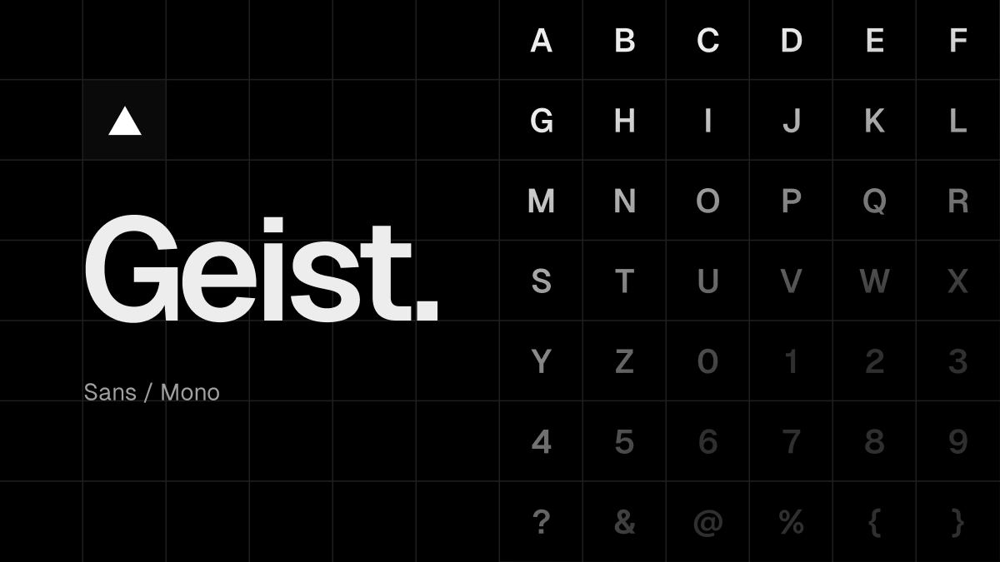

# Kodeka Sans & Kodeka Mono

Kodeka is a new font family created by [Khulnasoft](https://khulnasoft.com/design) in collaboration with [Basement Studio](https://basement.studio/).

Kodeka Sans is a sans-serif typeface designed for legibility and simplicity. It is modern, geometric, and based on the principles of classic Swiss typography. It is designed to be used in body copy, headlines, logos, posters, and other large display sizes.

Kodeka Mono is a monospaced typeface, crafted to be the perfect partner to Kodeka Sans. It is designed to be used in code editors, diagrams, terminals, and other text-based interfaces where code is rendered.


### Installation

```sh
npm install kodeka
```

### Using with Next.js

`KodekaSans` is exported from `kodeka/font/sans`, and `KodekaMono` can be found in `kodeka/font/mono`. Both are `NextFontWithVariable` instances. You can learn more by [reading the `next/font` docs](https://nextjs.org/docs/app/building-your-application/optimizing/fonts).

#### App Router

In `app/layout.js`:

```jsx
import { KodekaSans } from "kodeka/font/sans";

export default function RootLayout({
  children,
}) {
  return (
    <html lang="en" className={KodekaSans.className}>
      <body>{children}</body>
    </html>
  )
}
```

#### Pages Router

In `pages/_app.js`:

```jsx
import { KodekaSans } from "kodeka/font/sans";

export default function MyApp({ Component, pageProps }) {
  return (
    <main className={KodekaSans.className}>
      <Component {...pageProps} />
    </main>
  )
}
```

If you're using a version of Next.js that's older than 15, then in `next.config.js` or `next.config.mjs` add:

```diff js
/** @type {import('next').NextConfig} */
const nextConfig = {
  reactStrictMode: true,
+  transpilePackages: ["kodeka"],
};

export default nextConfig;
```

This is required to fix errors like:

- `TypeError: next_font_local__WEBPACK_IMPORTED_MODULE_0___default(...) is not a function`
- `SyntaxError: Cannot use import statement outside a module`

#### With Tailwind CSS

`KodekaSans` and `KodekaMono` can be used through a CSS variable.

- `KodekaSans`: `--font-kodeka-sans`
- `KodekaMono`: `--font-kodeka-mono`

In `app/layout.js`:


```jsx
import { KodekaSans } from 'kodeka/font/sans'
import { KodekaMono } from 'kodeka/font/mono'

export default function RootLayout({
  children,
}) {
  return (
    <html lang="en" className={`${KodekaSans.variable} ${KodekaMono.variable}`}>
      <body>{children}</body>
    </html>
  )
}
```

Then in `tailwind.config.js`:

```javascript
module.exports = {
  theme: {
    extend: {
      fontFamily: {
        sans: ['var(--font-kodeka-sans)'],
        mono: ['var(--font-kodeka-mono)'],
      },
    },
  },
}
```

### License
The Kodeka font family is free and open sourced under the [SIL Open Font License](./LICENSE.TXT).

### Inspiration
Kodeka has been influenced and inspired by the following typefaces: [Inter](https://rsms.me/inter), [Univers](https://www.linotype.com/1567/univers-family.html), [SF Mono](https://developer.apple.com/fonts/), [SF Pro](https://developer.apple.com/fonts/), [Suisse International](https://www.swisstypefaces.com/fonts/suisse/), [ABC Diatype Mono](https://abcdinamo.com/typefaces/diatype), and [ABC Diatype](https://abcdinamo.com/typefaces/diatype). We thank the creators of these typefaces for their craft.
